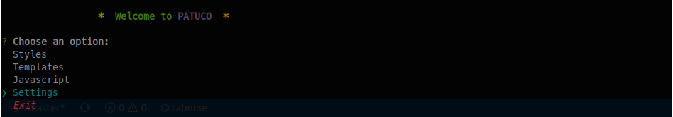
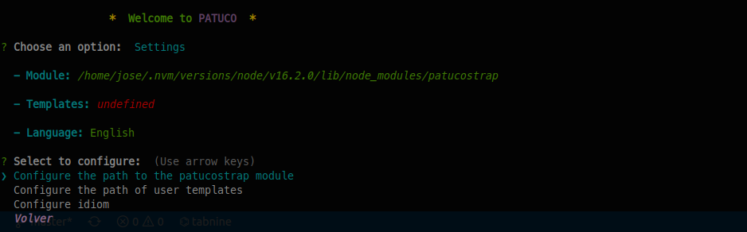
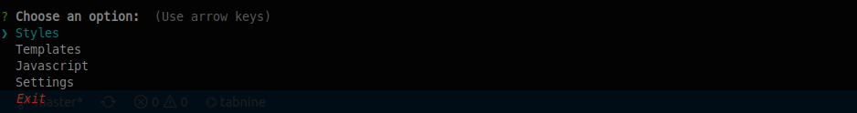
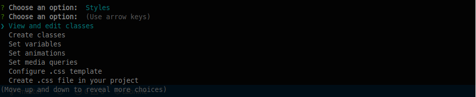
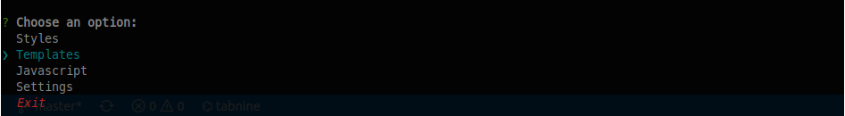

<h1 align="center">💉 shoehorn PATUCO   </h1>

# <br>Styles:

Quickly design and customize responsive websites just like you would with Bootstrap.
You can create css styles, css variables, animations, media queries among other options and save them to use them in any project.
When your project is ready, you can create an optimized css file with only the styles you have used.

# <br>Layouts:

Import and export components, views, models or whatever you need ...
You can save templates with the directories and files you need to quickly start projects or reuse files.
You can save templates with code to inject it into any file.

<br><br>&nbsp;**_If you want to try it before it's ready..._**

1. Clone the repo
   ```sh
   git clone https://github.com/joselrdg/patuco.git
   ```
2. Install NPM packages
   ```sh
   npm install
   ```
3. Create symbolic link in global folder:
   ```sh
   npm link (in package dir)
   ```
4. Start CLI patuco:
   ```sh
   patuco
   ```

# <br>Quick start:

Copy-paste the stylesheet <link> into your <head> before all other stylesheets to load our CSS.

In HTML:

```sh
   <link rel="stylesheet" type="text/css" href="patucostrap/style/patucoSchema.css" media="screen" />
```

In JSX:

```sh
  import "patucostrap/style/patucoSchema.css"
```

Type in the terminal. In your project directory:

```sh
patuco
```

Save the path where the patuco module is located, configure the path where you want to save your templates and configure the language.

Save the path to the file 'patucoConfig.js':

```sh
/home/tuNombre/.nvm/versions/node/v16.2.0/lib/node_modules/patucostrap/src/scripts/constants/patucoConfig.js
```




Now you can see the classes that "patuco" has or create new styles to incorporate them into your projects.




Import and export components, views, models or whatever you need...




### Index

<table>
  <tr>
    <td valign="top">
      <ul>
        <li><a href="#viewandeditclasses">ViewAndEditClasses</a></li>
        <ul>
          <li><a href="#perspectivecamera">PerspectiveCamera</a></li>
          <li><a href="#orthographiccamera">OrthographicCamera</a></li>
          <li><a href="#cubecamera">CubeCamera</a></li>
        </ul>
        <li><a href="#controls">Controls</a></li>
        <ul>
          <li><a href="#controls">Controls</a></li>
          <li><a href="#controls">FlyControls</a></li>
          <li><a href="#controls">MapControls</a></li>
          <li><a href="#controls">DeviceOrientationControls</a></li>
          <li><a href="#controls">TrackballControls</a></li>
          <li><a href="#controls">ArcballControls</a></li>
          <li><a href="#controls">PointerLockControls</a></li>
          <li><a href="#controls">FirstPersonControls</a></li>
          <li><a href="#transformcontrols">TransformControls</a></li>
          <li><a href="#scrollcontrols">ScrollControls</a></li>
          <li><a href="#presentationcontrols">PresentationControls</a></li>
        </ul>
        <li><a href="#abstractions">Abstractions</a></li>
        <ul>
          <li><a href="#image">Image</a></li>
          <li><a href="#text">Text</a></li>
          <li><a href="#line">Line</a></li>
          <li><a href="#quadraticbezierline">QuadraticBezierLine</a></li>
          <li><a href="#cubicbezierline">CubicBezierLine</a></li>
          <li><a href="#positionalaudio">PositionalAudio</a></li>
          <li><a href="#billboard">Billboard</a></li>
          <li><a href="#gizmohelper">GizmoHelper</a></li>
          <li><a href="#effects">Effects</a></li>
          <li><a href="#gradienttexture">GradientTexture</a></li>
          <li><a href="#useanimations">useAnimations</a></li>
        </ul>
        <li><a href="#shaders">Shaders</a></li>
        <ul>
          <li><a href="#meshreflectormaterial">MeshReflectorMaterial</a></li>
          <li><a href="#meshwobblematerial">MeshWobbleMaterial</a></li>
          <li><a href="#meshdistortmaterial">MeshDistortMaterial</a></li>
          <li><a href="#pointmaterial">PointMaterial</a></li>
          <li><a href="#softshadows">softShadows</a></li>
          <li><a href="#shadermaterial">shaderMaterial</a></li>
        </ul>
        <li><a href="#modifiers">Modifiers</a></li>
        <ul>
          <li><a href="#curvemodifier">CurveModifier</a></li>
          <li><a href="#useedgesplit">useEdgeSplit</a></li>
          <li><a href="#usetessellation">useTessellation</a></li>
          <li><a href="#usesimplification">useSimplification</a></li>
        </ul>
      </ul>
    </td>
    <td valign="top">
      <ul>
        <li><a href="#misc">Misc</a></li>
        <ul>
          <li><a href="#html">Html</a></li>
          <li><a href="#cycleraycast">CycleRaycast</a></li>
          <li><a href="#stats">Stats</a></li>
          <li><a href="#usedepthbuffer">useDepthBuffer</a></li>
          <li><a href="#usecontextbridge">useContextBridge</a></li>
          <li><a href="#usefbo">useFBO</a></li>
          <li><a href="#usecamera">useCamera</a></li>
          <li><a href="#usedetectgpu">useDetectGPU</a></li>
          <li><a href="#usehelper">useHelper</a></li>
          <li><a href="#useaspect">useAspect</a></li>
          <li><a href="#usecursor">useCursor</a></li>
          <li><a href="#useintersect">useIntersect</a></li>
        </ul>
        <li><a href="#loading">Loaders</a></li>
        <ul>
          <li><a href="#loader">Loader</a></li>
          <li><a href="#useprogress">useProgress</a></li>
          <li><a href="#usegltf">useGLTF</a></li>
          <li><a href="#usefbx">useFBX</a></li>
          <li><a href="#usetexture">useTexture</a></li>
          <li><a href="#usecubetexture">useCubeTexture</a></li>
        </ul>
        <li><a href="#performance">Performance</a></li>
        <ul>
          <li><a href="#instances">Instances</a></li>
          <li><a href="#merged">Merged</a></li>
          <li><a href="#points">Points</a></li>
          <li><a href="#segments">Segments</a></li>
          <li><a href="#detailed">Detailed</a></li>
          <li><a href="#preload">Preload</a></li>
          <li><a href="#bakeshadows">BakeShadows</a></li>
          <li><a href="#meshbounds">meshBounds</a></li>
          <li><a href="#adaptivedpr">AdaptiveDpr</a></li>
          <li><a href="#adaptiveevents">AdaptiveEvents</a></li>
          <li><a href="#usebvh">useBVH</a></li>
        </ul>
      </ul>
    </td>
  </tr>
</table>


# Cameras

#### PerspectiveCamera